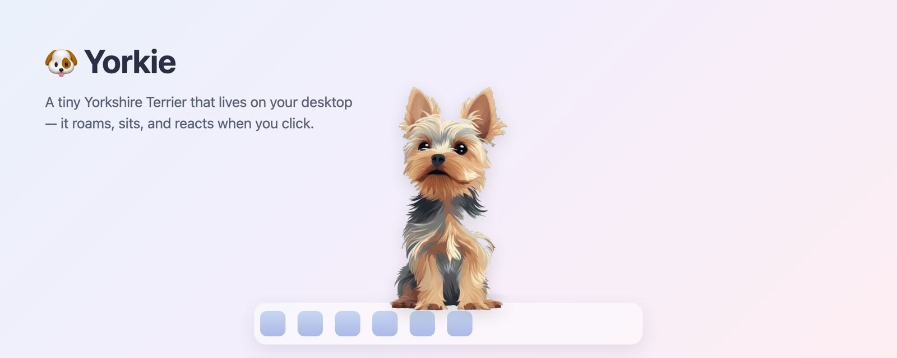

# Yorkie

A desktop pet Yorkshire Terrier that lives on your screen, roams around, rests with little actions, and reacts to your clicks. Built with Electron as a transparent, always-on-top window with no Dock icon.



## Highlights

- **Hand-drawn Yorkie that walks around your screen** and flips to face its travel direction.
- **Rests for random spells** and idles with little actions such as look around, yawn, jump, smile, stick out tongue, sneeze, lick, and lie down.
- **Reacts to you.** Click for a random emotion, drag to reposition, or double-click to dismiss.
- **Menu-bar control** with global hotkeys, `Cmd+Shift+Y` to summon and `Cmd+Shift+Q` to quit.
- **Stays out of the Dock and task switcher**, so it is a pet rather than an app window.

## Run

```bash
cd ~/yorkie-pet
npm start          # or: npx electron .
```

Or double-click `start.command` in Finder. Double-click `stop.command` to quit.

## How to interact

- Click the dog for a random emotion, one of joy, excitement, anger, or sad.
- Drag the dog to reposition it anywhere.
- Double-click the dog to show a close button that dismisses the pet.
- Use the menu-bar icon, the little Yorkie face, for *Come here (center)* and *Quit*.
- Press `Cmd+Shift+Y` to summon to center and `Cmd+Shift+Q` to quit.

## Behavior

- Roams to random spots anywhere on screen, switching between a sit pose and a walk pose, and flips to face its travel direction.
- Rests for a random spell from 5 seconds to an hour. While resting it does little actions including look around, yawn, jump, smile, stick out tongue, sneeze, lick, and lie down.
- Stays hidden from the Dock and task switcher.

## Project structure

```text
main.js          Electron main process. Transparent always-on-top window, roam and rest loop, tray, shortcuts
index.html       Pet UI. Sprites, CSS animations, click, drag, and double-click logic
preload.js       Secure bridge between the window and the main process
assets/          sit.png (resting), walk.png (moving), tray.png (menu-bar logo)
start.command    Double-clickable launcher to start the pet
stop.command     Double-clickable launcher to stop the pet
package.json     Electron dependencies and run scripts
```

## Start automatically at login (optional)

Open System Settings, then General, then Login Items. Add a new item with the plus button and choose `start.command`.

## License

Released under the MIT License. See [LICENSE](LICENSE).
